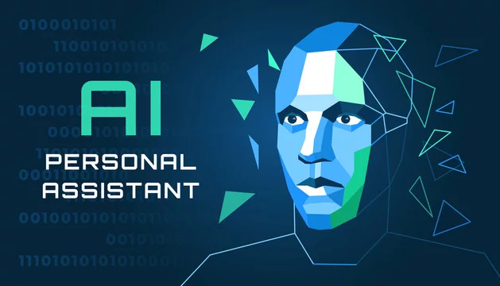

# Personal Assistant (Name: ULTRON)

This is a Personal Assistant which is an AI model such as Google Assistant or Alexa.

This Assistant is not having as complex functionality as any other present in, but we made it so that we can understand the basic principles of Artificial Intelligence and Machine learning.

  

## Contributing

Contributions are always welcome!

If any one do find some bugs and can add some extra features to it, definitely you can Contribute to it.

## Authors

- [@ghousetazeem](https://www.github.com/ghousetazeem)
- [@MohammedMaaz0213](https://github.com/MohammedMaaz0213)

